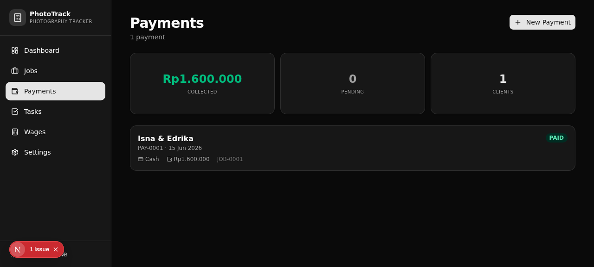
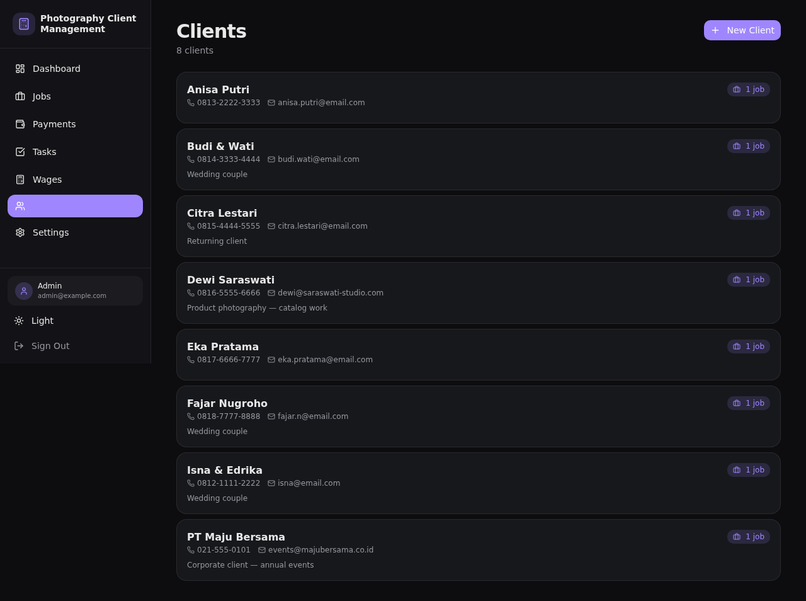
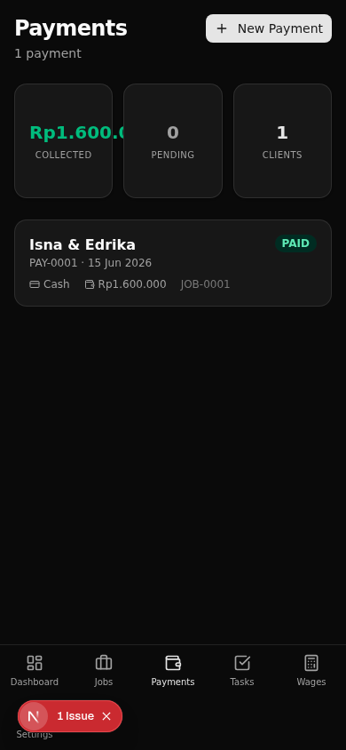

# Photography Client Management System

A comprehensive client management system designed for photography businesses. Track jobs, manage payments, distribute wages, and organize tasks all in one place.


## 📸 Screenshots

### Dashboard


### Client Management


### Mobile Responsive


## ✨ Features

### 📋 Job Management
- Create and track photography jobs with unique IDs (JOB-0001 format)
- Manage job statuses: Inquiry → Booked → Shot → Editing → Ready → Delivered → Completed
- Link jobs to clients or use free-text client names
- Track photographers, editors, and client sources
- Add detailed notes for each job

### 💰 Payment Tracking
- Record payments with multiple methods (Cash, Bank Transfer, QRIS, E-wallet, Card)
- Track payment statuses: UNPAID → Deposit-Paid → PAID → Refunded
- Support for both job-linked and standalone payments
- Automatic balance calculations

### 👥 Client Management
- Dedicated client database with contact information
- Link clients to jobs for better organization
- Store notes and history per client

### ✅ Task Management
- Create tasks linked to jobs or as standalone items
- Task statuses: OPEN → IN PROGRESS → WAITING → DONE → CANCELLED
- Due date tracking and priority management

### 👨‍👩‍👧‍👦 Staff & Wage Distribution
- Manage staff members with roles and contact info
- Configurable wage rules with percentage-based distribution
- Automatic wage calculation based on job payments
- Operational expense tracking
- Detailed breakdown of wage distributions

### 🔐 User Authentication
- Role-based access control (Admin/User)
- Secure password hashing with bcrypt
- Session management via NextAuth

### 🎨 Modern UI
- Built with shadcn/ui components
- Responsive design for mobile and desktop
- Dark mode support
- Interactive dashboards and data tables

## 🚀 Getting Started

### Prerequisites

- [Node.js](https://nodejs.org/) 18+ or [Bun](https://bun.sh/)
- Git

### Installation

1. **Clone the repository**
   ```bash
   git clone https://github.com/yourusername/photography-client-management.git
   cd photography-client-management
   ```

2. **Install dependencies**
   ```bash
   # Using npm
   npm install
   
   # Or using Bun (recommended)
   bun install
   ```

3. **Set up environment variables**
   ```bash
   cp .env.example .env
   ```
   
   The default `.env` configuration uses SQLite for local development:
   ```env
   DATABASE_URL="file:./db/custom.db"
   NEXTAUTH_SECRET="your-secret-key-here"
   NEXTAUTH_URL="http://localhost:3000"
   ```

4. **Initialize the database**
   ```bash
   # Push schema to database
   bun run db:push
   
   # Seed with demo data
   bun run seed
   ```

5. **Start the development server**
   ```bash
   bun run dev
   ```

6. **Open your browser**
   Navigate to [http://localhost:3000](http://localhost:3000)

### Demo Credentials

After seeding the database, you can log in with:

| Role | Email | Password |
|------|-------|----------|
| Admin | `admin@example.com` | `admin123` |
| User | `user@example.com` | `user123` |

## 📖 Available Scripts

```bash
bun run dev          # Start development server
bun run build        # Build for production
bun run start        # Start production server
bun run lint         # Run ESLint
bun run test         # Run tests with Vitest
bun run test:watch   # Run tests in watch mode

bun run db:push      # Push Prisma schema to database
bun run db:generate  # Generate Prisma client
bun run db:migrate   # Run database migrations
bun run db:reset     # Reset database and migrate
bun run seed         # Seed database with demo data
```

## 🏗️ Tech Stack

- **Framework:** Next.js 16 with App Router
- **Language:** TypeScript
- **Styling:** Tailwind CSS 4
- **UI Components:** shadcn/ui + Radix UI primitives
- **Database ORM:** Prisma
- **Database:** SQLite (local) / PostgreSQL (production)
- **Authentication:** NextAuth.js
- **State Management:** Zustand
- **Forms:** React Hook Form + Zod validation
- **Testing:** Vitest + Testing Library
- **Charts:** Recharts
- **Animations:** Framer Motion

## 🗄️ Database

The application supports two database modes:

### Local Development (SQLite)
- Zero configuration required
- Database file stored at `db/custom.db`
- Perfect for development and testing

### Production (PostgreSQL)
- Required for deployment platforms like Vercel
- Recommended providers: Neon, Supabase, Railway
- See [DEPLOY.md](./DEPLOY.md) for detailed deployment instructions

To switch to PostgreSQL:
1. Update `prisma/schema.prisma`: change `provider = "sqlite"` to `"postgresql"`
2. Set `DATABASE_URL` environment variable to your PostgreSQL connection string
3. Run `bun run db:push` to create tables
4. Run `bun run seed` to populate demo data

## 📁 Project Structure

```
photography-client-management/
├── src/
│   ├── app/              # Next.js App Router pages
│   ├── components/       # React components
│   │   ├── ui/          # shadcn/ui components
│   │   └── ...          # Feature components
│   ├── hooks/           # Custom React hooks
│   ├── lib/             # Utility functions and configs
│   └── middleware.ts    # Next.js middleware
├── prisma/
│   ├── schema.prisma    # Database schema
│   └── db/              # SQLite database file
├── public/              # Static assets
├── scripts/             # Database scripts
├── examples/            # Example code
└── download/            # Screenshots and documentation
```

## 🚢 Deployment

For deploying to Vercel or other platforms, see [DEPLOY.md](./DEPLOY.md).

Quick deployment steps:
1. Push code to GitHub
2. Import project in [Vercel](https://vercel.com/new)
3. Set environment variables:
   - `DATABASE_URL` (PostgreSQL connection string)
   - `NEXTAUTH_SECRET` (generate with `openssl rand -base64 32`)
   - `NEXTAUTH_URL` (your production URL)
4. Deploy!

## 🤝 Contributing

Contributions are welcome! Please feel free to submit a Pull Request.

1. Fork the repository
2. Create your feature branch (`git checkout -b feature/amazing-feature`)
3. Commit your changes (`git commit -m 'Add some amazing feature'`)
4. Push to the branch (`git push origin feature/amazing-feature`)
5. Open a Pull Request

## 📄 License

This project is licensed under the MIT License - see the [LICENSE](./LICENSE) file for details.

## 🙏 Acknowledgments

- [shadcn/ui](https://ui.shadcn.com/) for the beautiful UI components
- [Radix UI](https://www.radix-ui.com/) for accessible primitives
- [Prisma](https://www.prisma.io/) for the excellent ORM
- [Next.js](https://nextjs.org/) team for the amazing framework

## 📞 Support

For issues, questions, or suggestions, please open an issue on GitHub.

---

Built with ❤️ for photography professionals
